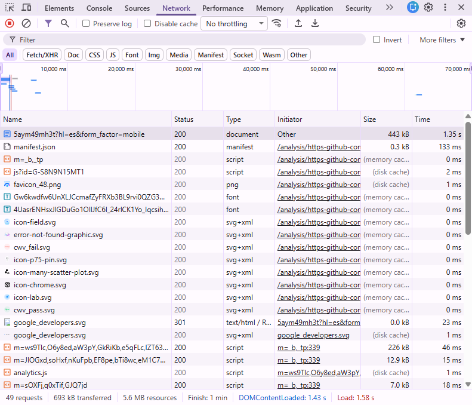
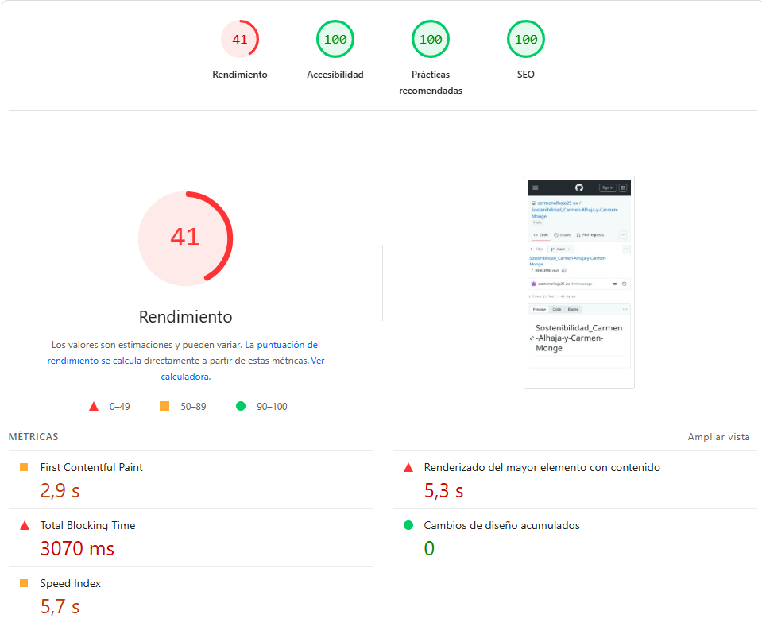
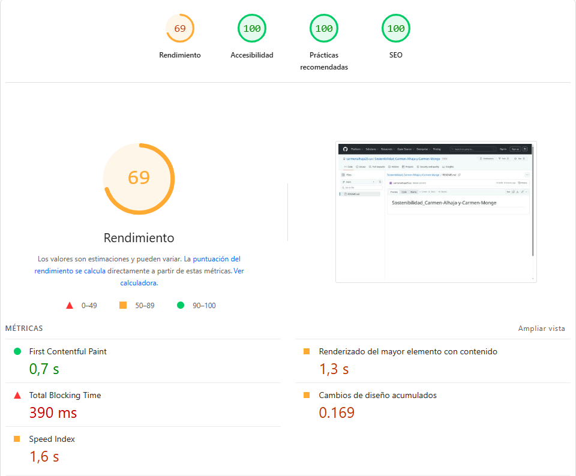
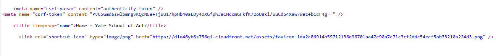

# Auditoría ASG y Refactorización Sostenible

# I. Inventario y Dimensión Ambiental (A)

Analiza el peso y consumo de la web elegida.

## 1.1. **Medición inicial**. Utiliza herramientas gratuitas como *Website Carbon Calculator* o *Lighthouse* (pestaña de rendimiento en Chrome/Edge) para obtener la huella de carbono estimada por visita.

La herramienta que vamos a utilizar para obtener la huella de carbono estimada por visita es Lighthouse, que es una pestaña de rendimiento en Chrome/Edge.

## 1.2. **Identificación de Bloatware**. Inspecciona la red (Network) en las herramientas de desarrollador del navegador. Identifica los 3 recursos más pesados que se descargan al abrir la web (imágenes sin comprimir, vídeos de fondo, librerías JavaScript pesadas, etc.).

Se descargan los siguientes recursos que vemos en la captura. De ellos, los más pesados son un documento de 443kB y dos scripts, el más pesado de 226kB y el menos pesado de 12.9 kB.

  

## 1.3. **Análisis**. ¿Crees que la web sufre de "inflación de software"?
Teniendo en cuenta que cada minuto que pasa va creciendo el número de recursos, pasando desde que lo abrimos por primera vez, de 49 hasta 56 en cuestión de minutos.
Decimos que sí hay inflación de software, aunque no a gran escala porque la cantidad de procesos, aunque aumenta, no consideramos que sea excesiva. El rendimiento en dispositivos móviles es más bajo, con una puntuación de 41 y en ordenadores con una puntuación de 69, un poco más alta, pero aún así sigue muy lejos del 100.

   
  

# II. Dimensión Social y Equidad (S)

La web debe ser utilizable por todos. Evalúa la accesibilidad (Sostenibilidad Social):

## 2.1. **Test de Accesibilidad**. Pasa una herramienta como *WAVE Web Accessibility Evaluation Tool* o el propio *Lighthouse* (pestaña *Accessibility*).

| Herramienta | Métrica / Resultado General | Observaciones Clave |
| :---- | :---- | :---- |
| **Lighthouse** | Puntuación (0-100) | Analiza la estructura semántica y mejores prácticas de ARIA. |
| **WAVE** | Número de Errores y Alertas | Detecta fallos de contraste y errores en el orden de los encabezados. |

## 2.2. **Identificación de barreras**. Documenta al menos 2 problemas graves que impidan a personas con diversidad funcional usar la web correctamente (ej. falta de atributos *alt* en imágenes clave, bajo contraste de colores en botones, formularios sin etiquetas).

### 2.2.1. Ausencia de Texto Alternativo (alt) en Imágenes Funcionales

Este es un fallo crítico de Sostenibilidad Social, ya que excluye directamente a los usuarios de lectores de pantalla como personas con ceguera o baja visión.

* **Descripción:**  Si una imagen que transmite información (como un gráfico de datos) no tiene el atributo alt, el lector de pantalla dirá simplemente "Imagen" o leerá el nombre del archivo (ej. IMG_5432.jpg), dejando al usuario sin contexto.
* **Impacto:** El usuario no puede completar procesos de navegación o compra porque no entiende qué acción representa el elemento visual.
* **Solución:** Implementar siempre el atributo alt en la etiqueta HTML de la imagen, proporcionando una descripción clara, concisa y funcional del contenido o de la acción que representa.

### 2.2.2. Insuficiente Contraste de Color en Textos y Botones

El bajo contraste es una barrera que afecta a personas con daltonismo, visión reducida o incluso a usuarios en condiciones de mucha luz solar.

* **Descripción:** Ocurre cuando la relación de contraste entre el color del texto y el fondo es inferior a **4.5:1** (según las pautas WCAG 2.1). Por ejemplo, un texto gris claro sobre un fondo blanco.  
* **Impacto:** Fatiga visual y falta de legibilidad. En botones de llamada a la acción (CTA), esto puede causar que el usuario ni siquiera perciba que existe un botón.  
* **Solución:** Ajustar la paleta de colores para asegurar que todos los elementos interactivos cumplan con los estándares de ratio de contraste.

Para elevar la equidad de la web de forma inmediata, se recomienda asegurar la **Navegación por Teclado**. Muchas webs olvidan el "foco" (el recuadro que indica dónde estás al pulsar Tab). Sin un indicador de foco visible, los usuarios con diversidad funcional motriz no pueden saber qué elemento están seleccionando. 

# III. Dimensión de Gobernanza y Ética (G)

Revisa cómo trata la empresa a sus usuarios y sus datos:

## 3.1. **Transparencia**. ¿Es fácil rechazar las cookies no esenciales o utilizan "patrones oscuros" (Dark Patterns) para forzar al usuario a aceptarlas?

Al entrar en la página web, no pide que se acepten cookies, deja ver la página con total libertad, salvo si se quiere acceder a los apartados de “Edit this page” y “Page history” de abajo a la izquierda, además de dar la opción de registrarse.

## 3.2. **Datos innecesarios**. ¿Pide la web datos personales excesivos en su formulario de contacto o registro?

La web no pide datos innecesarios, al iniciar sesión, da dos opciones para registrarse dependiendo de si se tiene un “Yale NetID” o no. Si se tiene, pide el NetID y la contraseña, y sino, el correo electrónico y la contraseña. No da la opción de registrarse, puesto que el usuario lo crea Yale, ya que tienes que ser miembro

# IV. Propuesta de Refactorización (Green Coding)

Como desarrollador/a, no basta con encontrar los fallos; debes proponer soluciones. Redacta una propuesta de mejora técnica detallando:
Optimización de activos.

## 4.1. ¿Qué formatos usarías para sustituir las imágenes actuales (ej. WebP, AVIF)?
Como se ve en la imagen, en el código de la web se usan imágenes en formato png. En nuestro código refactorizado usaremos WebP como formato, ya que hemos trabajado anteriormente con él y ofrece tanto una mayor calidad de imagen como optimización en la velocidad de carga en sitios.

## 4.2. ¿Implementarías Lazy Loading?
Si, implementaremos Lazy Loading porque tiene ciertos factores que nos parecen interesantes como la mejora de velocidad del código y de carga de la página web ya que aligera el peso inicial de esta. También hace que se ahorran muchos datos que no son necesarios que se descarguen y si el usuario no llega al final de la página, los datos ocultos, directamente no se descargan.

## 4.3. ¿Qué librerías o scripts externos eliminarías o aplazarías para mejorar la eficiencia del código y reducir el procesamiento en el dispositivo del cliente?
Para mejorar la eficiencia en el dispositivo del cliente y reducir las conexiones innecesarias al servidor, haremos los siguientes cambios:
Los scripts detectados en la auditoría de red bloquean el renderizado del HTML. Aplicar el atributo defer asegura que el script se descargue en segundo plano y solo se ejecute una vez que el DOM esté completamente cargado.
Si la web utiliza frameworks o librerías completas (como Bootstrap JS o jQuery) solo para pequeñas interacciones (menús desplegables, modales), las eliminaremos.

## 4.4. Si optimizamos la web y la carga mucho más rápido, podríamos atraer a muchos más usuarios diarios. ¿Cómo evitarías que este éxito anule el ahorro energético conseguido?
La paradoja de Jevons afirma que a medida que el progreso tecnológico aumenta la eficiencia con la que se utiliza un recurso, el consumo total de ese recurso tiende a aumentar en lugar de disminuir, debido a una mayor demanda.

En el diseño web, si optimizamos el sitio para que sea ligero y rápido, la experiencia de usuario mejora, lo que inevitablemente atraerá a más tráfico y aumentará el tiempo de permanencia en la página. Para evitar que este éxito de visitas anule el ahorro energético conseguido por la refactorización, implementaríamos las siguientes estrategias de mitigación:

Arquitectura Eficiente y Almacenamiento
Políticas estrictas de Caché (HTTP Caching): Configurar correctamente las cabeceras de caché (Cache-Control) para que los usuarios recurrentes no tengan que descargar ni un solo kilobyte de código estático (CSS, JS, logos) en sus siguientes visitas, eliminando la transferencia de datos casi por completo.

Implementación de Service Workers (PWA): Convertir la web en una Aplicación Web Progresiva para almacenar en caché los activos de forma local en el dispositivo del usuario. De este modo, las visitas posteriores consumen cero energía de red y de servidor.

Infraestructura y Sostenibilidad en el Servidor
Green Hosting: Alojar la infraestructura del sitio en centros de datos que funcionen al 100% con energía renovable certificada y que cuenten con sistemas avanzados de refrigeración eficiente.
Uso de Redes de Distribución de Contenido Sostenibles: Utilizar CDNs distribuidas geográficamente que también utilicen energías limpias. Al servir los archivos desde el nodo más cercano al usuario, se reduce la distancia física que recorren los datos a través de la infraestructura global de internet, disminuyendo el consumo energético de la red de tránsito.

# V. Refactorización. Propuesta
A continuación, se detalla una propuesta de mejora técnica estructurada para la web analizada, aplicando principios de *Eco-diseño Digital*, *Green Coding* y accesibilidad universal.

## 5.1. Posibles mejoras ambientales:
**Optimización de imágenes (WebP, compresión):** Sustituir el formato actual de las imágenes (".png") por formatos de última generación como **WebP**. Esto permite mantener la calidad visual reduciendo el peso del archivo y optimizando la velocidad de carga inicial de la página.

**Reducción de peticiones HTTP:** Minimizar las conexiones al servidor aplazando scripts externos que no sean críticos y eliminando llamadas redundantes a recursos innecesarios.

**Lazy loading:** Implementar la carga diferida mediante el atributo nativo "loading="lazy"". Con esto se evita la descarga automática de imágenes situadas fuera del primer scroll, aligerando el peso inicial de la web y logrando un importante ahorro de datos para el usuario.

**Eliminación de código no utilizado:** Identificar, limpiar y purgar las librerías o scripts pesados detectados en la pestaña *Network* que dejen rastro de "software inflado" (*bloatware*) y consuman procesamiento innecesario en la CPU del cliente.

## 5.2. Posibles mejoras sociales:
**Uso de HTML semántico (header, nav, main, etc.):** Reestructurar la arquitectura interna de la web reemplazando los contenedores genéricos ("
") por etiquetas nativas de HTML5. Esto mejora la indexación y es clave para que las tecnologías asistenciales interpreten correctamente la jerarquía del sitio.

**Inclusión de atributos "alt":** Incorporar descripciones textuales claras en todas las imágenes funcionales. Al resolver esta ausencia, se elimina una barrera crítica de exclusión para personas ciegas o con visión reducida que dependen de lectores de pantalla.

**Mejora del contraste:** Ajustar las hojas de estilo (CSS) para que las combinaciones de color de los textos y botones interactivos superen una relación de contraste mínima de 4.5:1. Con esto se mitiga la fatiga visual y se garantiza la legibilidad bajo cualquier condición lumínica.

**Navegación accesible:** Asegurar la navegación íntegra mediante el teclado, garantizando que el indicador visual de foco (`:focus`) sea perfectamente visible al pulsar la tecla Tab. Esto permite que usuarios con diversidad funcional motriz sepan exactamente qué elemento están seleccionando.

## 5.3. Posibles mejoras de gobernanza:
## 5.4. Propuesta técnica:
